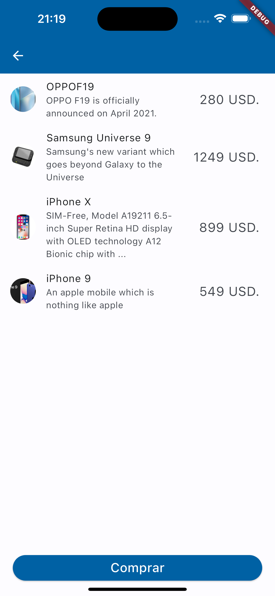

# Ecommerce Sample

Hello welcome, I hope you are feeling well.
Thank you for viewing my repo, here's how you can run it on your machine

## Requeriments
- Flutter SDK 3.19.2

## Run
- Clone repository:
```c
git@github.com:MiguelBelotto00/ecommerce_sample.git
```
- Open project directory:
```c
cd users/your_user/Desktop/ecommerce_sample
```
- Get Dependencies:
```c
//with fvm
    fvm use 3.19.2
    fvm flutter pub get
//with flutter
    flutter pub get
```
- Run the app
```c
//Please connect a device with developer mode or use a Emulator
flutter run lib/main.dart
```

## Gallery


| Image | Image |
|-------|-------|
|  |  |
|  |  |
|  |  |
|  |


https://github.com/MiguelBelotto00/ecommerce_sample/assets/84353662/e6b9a467-2da1-4b67-ad8d-b3e9af787e25


